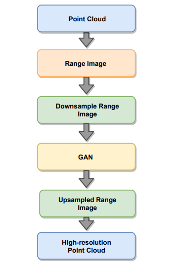
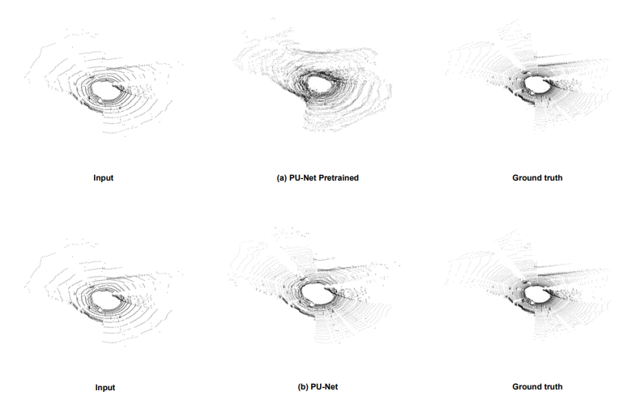
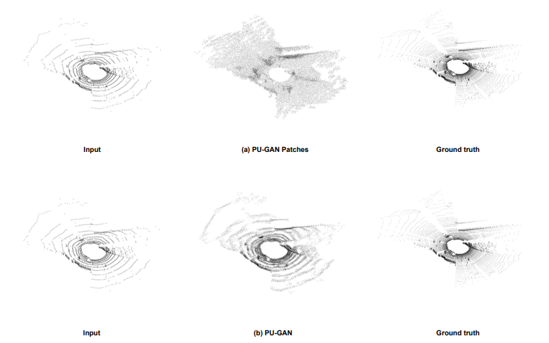
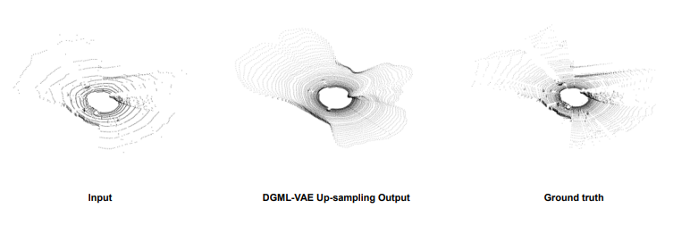
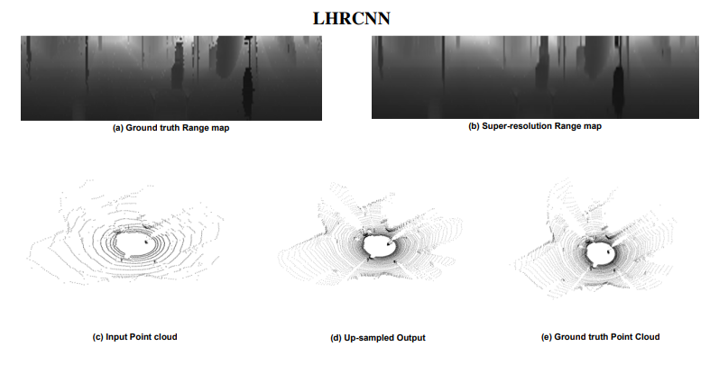
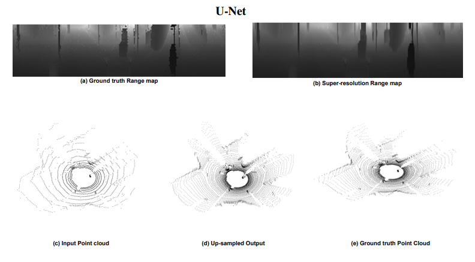
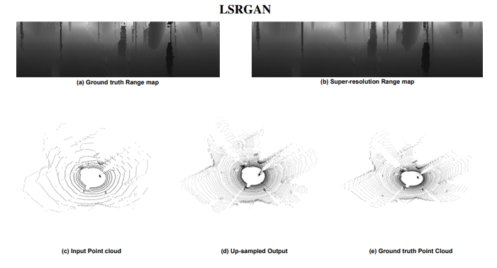
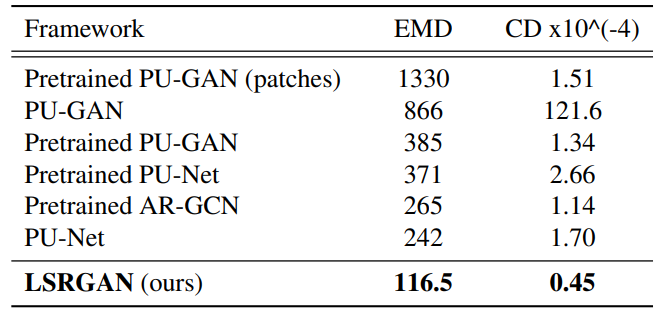
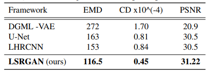

# Lidar Point Cloud Up-sampling using GAN

In this work I built a framework called Lidar Super-Resolution GAN (LSRGAN) a GAN-based network with geometric losses to upsample the LiDAR point clouds.
Achieved the goal of obtaining a dense up-sampled point cloud that retains the LiDAR lines structure. This is widely regarded as the first step of LiDAR processing
and scene understanding and has shown to contribute in improving the efficiency in many applications such as: object detection, semantic segmentation, and localization and mapping.

Report: Final_Report_Updated_Lidar_PointCloud_Upsampling_Using_GANs.pdf

## Datasets

KITTI and Nuscenes datasets were used for training

## Baseline Models
Five different models that work on point clouds are choosed as baselines.

### Point cloud based baselines 
```
- PU-Net
- PU-GAN
- Deep Generative Model- VAE (DGML-VAE)
```
### Range image based baselines
```
- CNN-based High-Resolution LiDAR Synthesis (LHRCNN)
- U-Net
```

## Overview
The overview of this proposed framework is described in the workflow below.

#### <p align="left"> Work Flow </p>
| |
|:-------------------------:
|<p align="center">  </p>|

## Baseline Model Results
All the baseline models are compared using the output point cloud data and range images depending on the architecture.

#### <p align="left"> Point Cloud Upsampling Network (PU-Net) </p>
| |
|:-------------------------:
|<p align="center">  </p>|


#### <p align="left"> Point Cloud Upsampling GAN (PU-GAN)  </p>
| |
|:-------------------------:
|<p align="center">  </p>|


#### <p align="left"> Deep Generative Modeling-VAE (DGML-VAE)  </p>
| |
|:-------------------------:
|<p align="center">  </p>|


#### <p align="left"> CNN-based High-Resolution Model (LHRCNN) </p>
| |
|:-------------------------:
|<p align="center">  </p>|


#### <p align="left"> U-Net Model </p>
| |
|:-------------------------:
|<p align="center">  </p>|

## Our Framework Result
#### <p align="left"> LiDAR Super-Resolution GAN (LSRGAN) </p>
| |
|:-------------------------:
|<p align="center">  </p>|


## Quantitative Results

Point cloud based architectures are evaluated using EMD and CD metrics.
Range image based architectures are evaluated using EMD, CD and PSNR metrics.

### <p align="left"> Point cloud based architecture </p>
| |
|:-------------------------:|
|<p align="center">  </p>|


### <p align="left"> Range image based architecture </p>
| |
|:-------------------------:
|<p align="center">  </p>|


